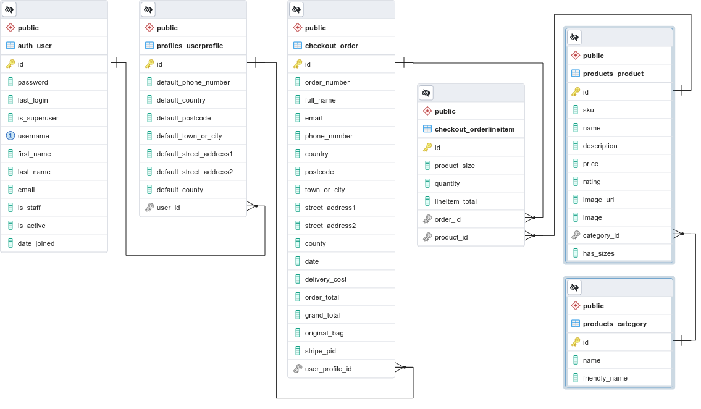
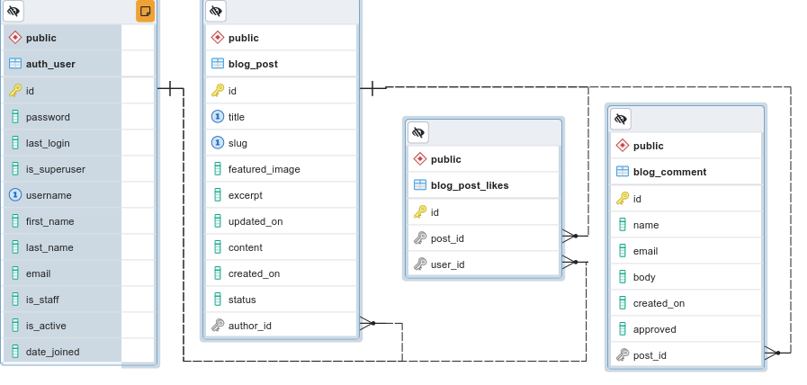

# CYBERSHOP

Cybershop is an online shop specifically customized for a retailer who has a business offering items for sale aimed at makers, tinkerers and students of technologies related to robotics, 3D printing, Computer Vision and other emerging technology areas.

On this website a customer will be able to view and purchase the products offered by the customer, share information about their ideas and projects related to these products and search for information about related technologies.

## Features 
This project defines an E-Commerce platform based on the Django framework, where the following features are offered:

- Base page
    > This page will be the frame for all the rest of pages
    * Contains a Navigation Bar on the top (The Main Menu).
    * Contais the placeholder for any of the rest of the pages
    * Contains a footer with company and contact information at the bottom.

- The Main menu
    * This is a base top bar menu that brings access to all the rest of the pages
    * There is a language, country and currency selector (Future feature)
    * There is a search feature where the user can search the shop's product inventory.
    * Direct access to the products page to start shopping 
    * Displays current user and ofers the user submenu options
        - If the user is signed in
            * User profile
            * End session
        - if not signed in
            * Sign in
            * register
            * End session
    * Direct Shopping Cart access
    * Direct Checkout and payment access
    * Direct access to the site Blog

- The 'Home' page :  
    * It offers tech news and special deals that the user may find interesting.
    * A quick search tool is available to browse the shop's product inventory.

- The 'About Us' page:  
    * Displays information about the company
    * Contains a footer with company and contact information.

- The 'Sign up" page:
    * Allows a user to register with the server for future visits.
    * verify registration using e-mail validation

- The user profile page
    * Displays an updatable form wuth Customer specific information
        Name, delivery Address, billing Address, payment form, etc
    * Displays the list of orders placed by the user and their status.
    * Allows to review any order

- The products page:
    * Presents a search and filter options to find the products by specific clasifications
    * A list of products available for sale is presented with photo and price.

- Product detail page
    * Displays the specific product with details
    * Allows to add the product to the shopping cart

- Shopping cart page
    * Displays the list of products in the shopping cart
    * Displays individual and total costs
    * Allows to place and order with specified products form the shopping cart

- Order page
    * Displays the list of products in the order
    * Displays individual and total costs
    * Inputs delivery information
    * Inputs payment information
    * Allows to place and order using a payment processing platform (Stripe) 

- The Support page
    * list of supported products with links to their specific tech documments.

- The Comunity 
    * list of news, events and the company related information

- The Blog Page:
    * Presents a standard blog for posting articles, information and comments 

### Existing Features

- __Navigation Bar__

  - Featured on all pages, the full responsive navigation bar includes links to the Logo, Home page, About Us  and Sign Up page, and is identical in each page to allow for easy navigation.
  - This section will allow the user to easily navigate from page to page across all devices without having to revert back to the previous page via the ‘back’ button. 

- __The Content menu__

  - The content menú provides a way for the user to directly access to all the pages web site .
  

- __The Footer__ 

    - The footer section includes:
      * links to the relevant social media sites. The links will open to a new tab to allow easy navigation for the user. 
      * Name, phone number and email information for the company
      * Web site developer contact information
      
  - The footer is valuable to the user as it encourages them to keep connected via social media

- __About Us Page__

  - This page will provide the user with information over the company.
  - This section is valuable to the user to identify the type of company and people behind the service. 

- __The Sign Up Page__

  - This page will allow the user to register in the web site and aloww for a more personalized experience. A profile will be created with personal, orders, delivery and billing information so the user will not need to retype it on future visits.
  - The user will be asked for a username, password, full name and email address which will be used to validate the registration. 

### Features Left to Implement

## The database models

### User information
This model provides persistent support for user information. Since there are different user roles, a scheme of roles. Permissions and authorizations must be established.
Since "Django-allauth" is used as a framework, the base database model is already defined, and we have simply extended it to adapt it to the needs of this project using the object/table `auth_user` as link.

### Orders information
This model is subdivided in three submodels, first one defines the objects and storage for the  `user profiles`, the seccond defines the objects and storage for the `products`, and the third one defines the objects and storage for `purchase orders`.

### Blog Information

## Testing 

### Validator Testing 

- HTML
  - No errors were returned when passing through the official [W3C validator](https://validator.w3.org/nu/?doc=https://8000-juanma1313-cybershop-70agewrxojr.ws-us106.gitpod.io/)
- CSS
  - No errors were found when passing through the official [(Jigsaw) validator](https://jigsaw.w3.org/css-validator/validator?uri=https://8000-juanma1313-cybershop-70agewrxojr.ws-us106.gitpod.io&profile=css3svg&usermedium=all&warning=1&vextwarning=&lang=en#css)

### Testing on diferent device resolutions 
- Desktops (width screen resolution from 4k down to 1024)
  - All pages
  - Landing Page
  - About Us Page
  - Sign Up Page
  
- Tablets & big moviles (width screen resolution between 1024 and 768 horizontal  pixels )
  - All pages
  - Landing Page
  - About Us Page
  - Sign Up Page

- Tablets & big moviles (width screen resolution smaller than 768 horizontal pixels )
  - All pages
  - Landing Page
  - About Us Page
  - Sign Up Page

### Unfixed Bugs

  
## Deployment

- The site was deployed to HEROKU. The steps to deploy are as follows: 

The live link can be found here - https://juanma1313.github.io/cybershop/index.html

## Credits 

### Content 

- base.html Implement was addapted from the CI Boutique_Ado project
- Models for database objects `user preferences`, `products`, `orders` and `blog` are borrowed from CI Boutique_Ado and CI Django_Blog projects.

### Media
- All `static/` and `media/` files are created and designed by Juan Manuel de las Heras

